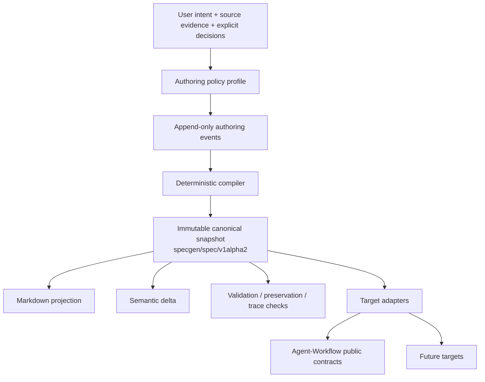
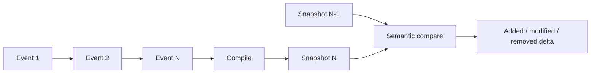
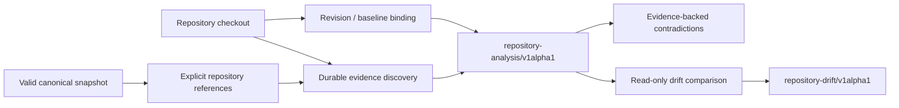

# Architecture

> Document version: 0.2.0 · Applies to SpecGen 0.2.0

Working architecture. Significant changes require an ADR. Engineering constraints are in [ENGINEERING_POLICY.md](ENGINEERING_POLICY.md).

## Authority and flow



This diagram is the single source for the project authority flow. Only the canonical snapshot owns current specification meaning. Authoring events preserve why meaning changed. Deltas explain changes between snapshots. Target artifacts may add target-required execution metadata but may not redefine requirements.

## Authoring history and snapshot boundary



`specgen/authoring-event/v1alpha1` is separate from `specgen/spec/v1alpha2`. Snapshot consumers do not replay history to discover current truth.

## Components

| Component | Responsibility |
|---|---|
| Canonical IR | Specification meaning, IDs, scope, requirements, contracts, decisions, acceptance, evaluation intent, implementation decomposition, trace, provenance. |
| Authoring events | Validated append-only single-writer NDJSON history with stable IDs and contiguous sequencing. |
| Elicitation | Express/guided/strict/Agent-Workflow policy profiles producing typed questions and guardrails. |
| Evidence analysis | Revision-bound deterministic repository evidence and declared interface/data-contract discovery; no arbitrary source semantic claims. |
| Brownfield research | Targeted agent research plan plus separately typed semantic findings; may use optional codebase-memory-mcp without making it a core dependency or authority. |
| Compiler | Candidate readiness/finalization and digest-bound immutable canonical snapshots. |
| Validators | JSON Schema, IDs/refs, dependencies, trace, preservation, snapshot ancestry/digest checks. |
| Semantic diff | Stable-ID semantic comparison excluding snapshot bookkeeping. |
| Renderers | Deterministic human-readable projection from canonical state. |
| Evaluation compiler | Portable evaluation intent plus fail-closed target lowering where target semantics are sufficient. |
| Agent-Workflow adapter | **Implemented through 0.1.10:** native prompt-pack resources, packaged result schemas, evaluation plan, Git source baseline, target checksums, and pinned-schema validation. |
| CLI / skill / app | Thin interaction surfaces over the same contracts; skill/plugin/app layers must not introduce another specification authority. |

## Canonical contract boundaries

`v1alpha2` carries stable lifecycle-aware IDs, current/proposed state, immutable snapshot identity/ancestry, typed provenance, preservation claims, and invariant requirements. Proposed state identifies `base_snapshot_id` and `change_id`. `v1alpha1` remains immutable.

Canonical snapshot digests are SHA-256 over sorted compact UTF-8 JSON with `snapshot.content_digest` omitted before hashing, avoiding self-reference.

## Repository evidence flow



This is the canonical repository-analysis diagram. Semantic interpretation of arbitrary source remains outside the deterministic boundary.

Agent-assisted brownfield analysis is a second, explicitly non-deterministic layer:

```text
canonical intent + repository-analysis/v1alpha1
                  |
                  v
       brownfield-plan/v1alpha1
          |                 |
          |                 +--> user decision questions
          v
 optional codebase-memory-mcp / targeted repository tools
          |
          v
 brownfield-analysis/v1alpha1
          |
          +--> selected provenance / requirements / preservation / risk updates
```

The plan may detect a local `codebase-memory-mcp` executable, but MCP registration is owned by the calling agent/runtime. The semantic artifact records evidence locators and confidence; it never upgrades inference into deterministic discovery. See [BROWNFIELD_AUTHORING.md](BROWNFIELD_AUTHORING.md) and ADR-0008.

## Agent-Workflow target lowering

The target adapter is a deterministic projection, not an execution subsystem:

```text
canonical snapshot + optional bound repository analysis
                    |
                    v
          Agent-Workflow adapter
             |      |      |
             |      |      +--> source-baseline/v1
             |      +---------> evaluation-plan/v1
             +----------------> prompt-pack/v1 + pack-relative resources
```

`0.1.10` requires Agent-Workflow authoring readiness before compilation. Result contracts become real JSON Schema files inside the prompt pack. Repository baseline emission requires an exact spec-bound Git analysis and live state agreement. Evaluation constructs that cannot be represented faithfully fail closed rather than being dropped or globally conflated.

Source prompt packs carry `MANIFEST.sha256`; Agent-Workflow alone owns the reserved archive `MANIFEST.json` (`agent-workflow/pack-manifest/v1`).

See [AGENT_WORKFLOW_INTEGRATION.md](AGENT_WORKFLOW_INTEGRATION.md) for detailed lowering rules.

## Compatibility boundary

Agent-Workflow remains a versioned target, not a core dependency. Release compatibility authority lives under `compat/`; moving development source is configured through ignored `dev/agent-workflow.toml`. No private Agent-Workflow modules are imported into SpecGen core.

## Public seams

```text
specgen render SNAPSHOT [--output SPEC.md]
specgen events append EVENT_LOG EVENT
specgen diff BEFORE AFTER
specgen author assess SNAPSHOT --mode MODE
specgen author finalize SNAPSHOT --mode MODE --output SNAPSHOT
specgen repo analyze REPO [--spec SNAPSHOT] [--mode MODE]
specgen repo drift ANALYSIS REPO
specgen brownfield capabilities
specgen brownfield plan REPO [--spec SNAPSHOT] [--mode MODE]
specgen evals intent SNAPSHOT
specgen agent-workflow compile SNAPSHOT --output DIR [--repository-analysis ANALYSIS] [--repository-root REPO]
```

The existing critical-seam test corpus remains intentionally small. No tests are added merely because Phase 6 gained more code; verification is run only under the project testing policy and is currently disabled by explicit instruction.

### Stable application facade

`specgen.api` is a narrow programmatic facade that re-exports existing authorities. It does not own state, persistence, orchestration, or an alternate schema. The CLI, skill, and optional Agent-Workflow plugin are adapters over the same core modules.

The optional `agent-workflow-spec` adapter is loaded only through Agent-Workflow's public plugin API. Agent-Workflow remains an execution target/host; SpecGen core remains independently usable and must not import Agent-Workflow private implementation modules.

### Installed runtime assets

The source-tree schema and compatibility files remain the only maintained copies. Packaging installs those exact files under `share/specgen`; `contracts.repo_root()` resolves either the source checkout or installed data location. This keeps normal package/plugin use functional without forking contract bytes into a second Python resource tree.
