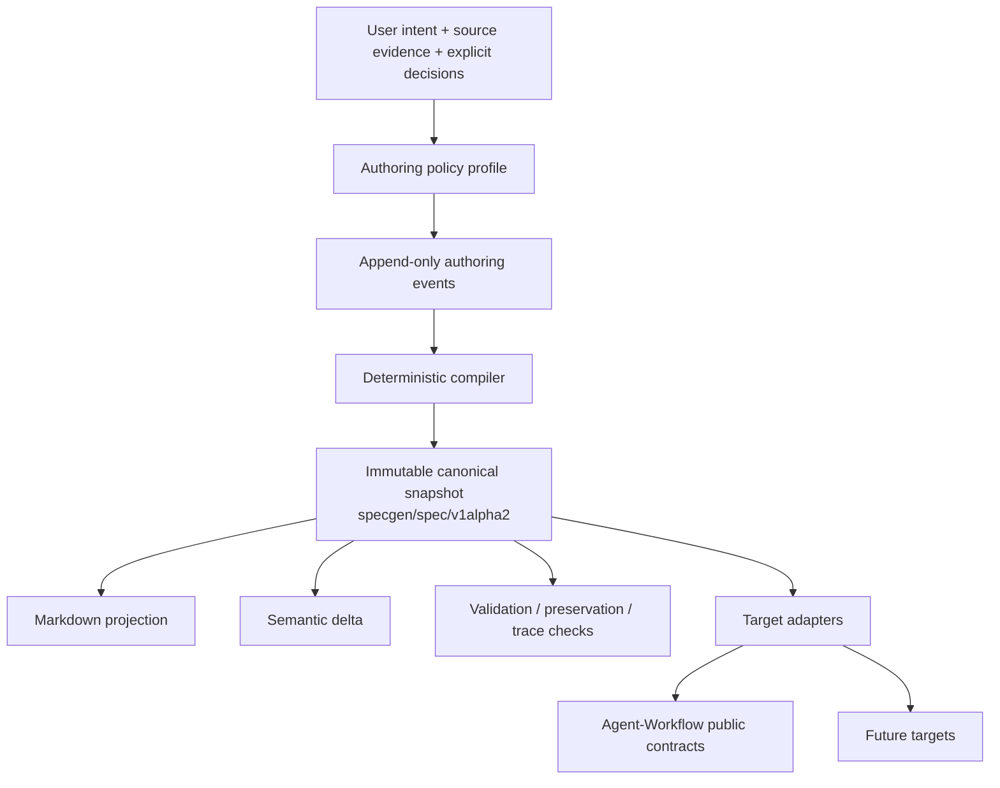
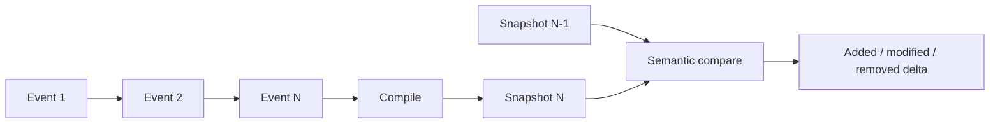

# Architecture

> Document version: 0.1.5 · Applies to SpecGen 0.1.5 · Canonical spec: `specgen/spec/v1alpha2`

Working architecture. Significant changes require an ADR. Engineering constraints are in [ENGINEERING_POLICY.md](ENGINEERING_POLICY.md).

## Authority and flow



This diagram is the single source for the project authority flow. Link here rather than duplicating it.

Only the canonical snapshot owns current specification meaning. Authoring events preserve why meaning changed. Deltas explain changes between snapshots. Target artifacts may add target-required execution metadata but may not redefine requirements.

## Authoring history and snapshot boundary



`specgen/authoring-event/v1alpha1` is separate from `specgen/spec/v1alpha2`. Consumers of a snapshot do not replay history to discover current truth.

## Canonical contract boundaries

`v1alpha2` deliberately adds:

- stable IDs and retirement state for durable objects;
- `state.kind` to distinguish current from proposed state;
- immutable snapshot identity and ancestry/event references;
- typed provenance sources;
- preservation claims mapping load-bearing source material to canonical objects or an explicit exclusion/unresolved state;
- `invariant` as a requirement type.

Proposed state must identify both `base_snapshot_id` and `change_id`. Semantic deltas remain derived artifacts rather than canonical truth.

## Components

| Component | Responsibility |
|---|---|
| Canonical IR | Specification meaning, IDs, scope, requirements, contracts, decisions, acceptance, eval intent, implementation decomposition, trace, provenance. |
| Authoring events | **Implemented persistence seam:** validated single-writer NDJSON append log with contiguous sequences, stable event IDs, and supersession-reference checks. |
| Elicitation | **Implemented deterministic policy seam:** express, guided, strict, and Agent-Workflow authoring profiles produce typed questions and guardrails in `specgen/elicitation-plan/v1alpha1`. |
| Evidence analysis | Structured repository/document/research evidence bound to revisions where possible. |
| Compiler | **Implemented candidate-finalization seam:** valid candidates are assessed under the selected authoring profile, blocked when required guardrails fail, then digest-bound as canonical snapshots. Full event/evidence synthesis remains later work. |
| Validators | **Implemented core:** JSON Schema, stable-ID uniqueness, critical reference integrity, task dependency cycles, trace references, preservation semantics, snapshot ancestry/digest checks. Later: drift/convergence and target compatibility. |
| Semantic diff | **Implemented:** versioned `specgen/semantic-delta/v1alpha1` output; stable-ID entity matching; snapshot bookkeeping excluded from semantic changes. |
| Renderers | **Implemented:** deterministic `SPEC.md` projection from a valid canonical snapshot. |
| Evaluation compiler | Lower verification intent into portable/target-specific eval artifacts. |
| Target adapters | Isolated lowering into exact public external contracts. |
| CLI / skill / app | Thin interaction surfaces over the same contracts. |

## Validation layers

Current deterministic core:

1. JSON Schema Draft 2020-12 + format checks.
2. Stable-ID uniqueness and critical reference integrity.
3. Trace-reference integrity and authoring coverage warnings.
4. Preservation mapping semantics.
5. Snapshot ancestry and declared canonical-digest verification.

Planned layers: drift/convergence checks, target compatibility, and optional clearly non-authoritative model critique.

Canonical snapshot digests are SHA-256 over sorted compact UTF-8 JSON with `snapshot.content_digest` omitted before hashing, avoiding a self-referential digest.

## Compatibility boundary

Agent-Workflow remains a versioned target, not a dependency. Release compatibility authority is under `compat/`; moving development source is declared in `dev/agent-workflow.toml`. See [AGENT_WORKFLOW_INTEGRATION.md](AGENT_WORKFLOW_INTEGRATION.md).


## Critical verification seam

Phase 1 is protected by one black-box CLI seam rather than internal unit-test coverage: canonical and authoring-event validation, broken references, task dependency cycles, and digest mismatch. See [`tests/critical-seams/run.py`](../tests/critical-seams/run.py).

## Phase 2 public seams

```text
specgen render SNAPSHOT [--output SPEC.md]
specgen events append EVENT_LOG EVENT
specgen diff BEFORE AFTER
```

Rendering and diffing require valid `specgen/spec/v1alpha2` inputs. Event persistence is append-only and intentionally single-writer in this phase; concurrency control is deferred until a concrete multi-writer requirement exists. Semantic delta output is a derived artifact and never becomes canonical specification authority.


## Phase 3 authoring profiles

The [authority-flow diagram](#authority-and-flow) is authoritative for mode placement: a mode shapes authoring policy before canonicalization; it is not canonical specification state. See [ADR-0006](adr/ADR-0006-authoring-modes-and-agent-workflow-profile.md).

`agent-workflow` mode adds strict guardrails for phased implementation, requirement/task coverage, structured result contracts, and evaluation intent so a later adapter can lower the snapshot into pinned Agent-Workflow prompt-pack/evaluation-plan contracts.
