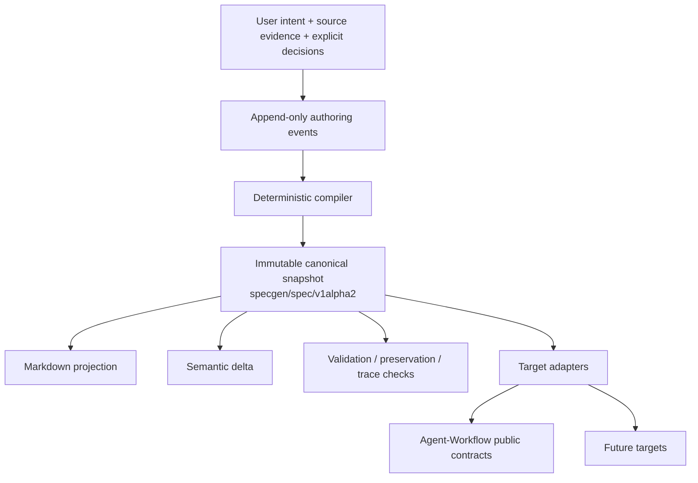
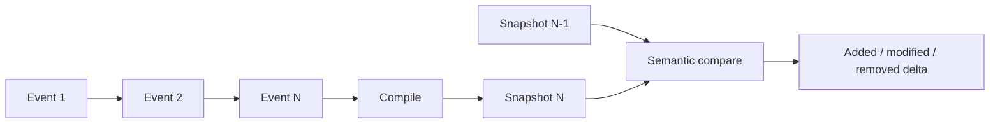

# Architecture

> Document version: 0.1.1 · Applies to SpecGen 0.1.1 · Canonical spec: `specgen/spec/v1alpha2`

Working architecture. Significant changes require an ADR. Engineering constraints are in [ENGINEERING_POLICY.md](ENGINEERING_POLICY.md).

## Authority and flow

This diagram is the single source for the project authority flow. Link here rather than duplicating it.

Only the canonical snapshot owns current specification meaning. Authoring events preserve why meaning changed. Deltas explain changes between snapshots. Target artifacts may add target-required execution metadata but may not redefine requirements.

## Authoring history and snapshot boundary

`specgen/authoring-event/v1alpha1` is separate from `specgen/spec/v1alpha2`. Consumers of a snapshot do not replay history to discover current truth.

## Canonical contract boundaries

`v1alpha2` deliberately adds:

- stable IDs and retirement state for durable objects;
- `state.kind` to distinguish current from proposed state;
- immutable snapshot identity and ancestry/event references;
- typed provenance sources;
- preservation claims mapping load-bearing source material to canonical objects or an explicit exclusion/unresolved state;
- `invariant` as a requirement type.

Proposed state must identify both `base_snapshot_id` and `change_id`. Semantic deltas remain derived artifacts rather than canonical truth.

## Planned components

| Component | Responsibility |
|---|---|
| Canonical IR | Specification meaning, IDs, scope, requirements, contracts, decisions, acceptance, eval intent, implementation decomposition, trace, provenance. |
| Authoring events | Append-only decisions/evidence/questions/corrections/supersession history. |
| Elicitation | Ask only high-value questions not safely derivable from evidence. |
| Evidence analysis | Structured repository/document/research evidence bound to revisions where possible. |
| Compiler | Convert event/evidence state into deterministic canonical snapshots. |
| Validators | Schema, referential integrity, trace coverage, preservation, drift/convergence, target compatibility. |
| Renderers | Read-only human projections from canonical state. |
| Evaluation compiler | Lower verification intent into portable/target-specific eval artifacts. |
| Target adapters | Isolated lowering into exact public external contracts. |
| CLI / skill / app | Thin interaction surfaces over the same contracts. |

## Validation layers

1. JSON Schema.
2. Stable-ID and referential integrity.
3. Trace coverage.
4. Preservation coverage.
5. Deterministic semantic lint/drift/convergence checks.
6. Target compatibility.
7. Optional model-assisted critique, clearly non-authoritative.

## Compatibility boundary

Agent-Workflow remains a versioned target, not a dependency. Release compatibility authority is under `compat/`; moving development source is declared in `dev/agent-workflow.toml`. See [AGENT_WORKFLOW_INTEGRATION.md](AGENT_WORKFLOW_INTEGRATION.md).
