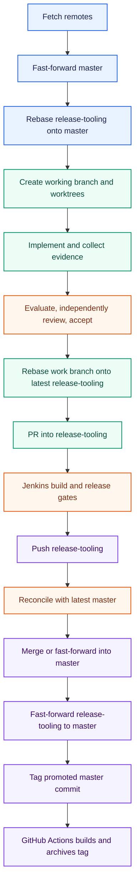

# Branch, Release, and Promotion Workflow

> Document version: 0.2.0 · Applies to SpecGen 0.2.0

This is the required delivery strategy for SpecGen and Agent-Workflow changes.
`master` is the production integration branch. `release-tooling` is the
development and QA branch. A repository may substitute `main` or
`production`, but the roles and ordering remain the same.

## Critical review of the proposed flow

The proposal is sound: work starts from synchronized production, isolated work
is based on QA, CI gates release, and promotion happens only after artifact and
live smoke evidence. The accepted changes are:

1. Use `git fetch` followed by fast-forward-only updates. A blind `pull` can
   create an accidental merge; pushing is a publication step, not sync.
2. Before work, fetch remotes, fast-forward `master`, then rebase
   `release-tooling` onto `master`. Coordinate first if QA is shared.
3. Create worktrees from the working branch and record their base commit and
   source provenance. Completion, evaluation, review, and acceptance remain
   separate gates.
4. Before merging a PR into QA, rebase it onto current `release-tooling`.
   Before production promotion, reconcile QA with current `master`.
5. After promoting QA into production, explicitly fast-forward the
   `release-tooling` pointer to `master`. A rebase alone can leave QA at its
   old ancestor because it already is an ancestor of `master`.
6. Jenkins must publish evidence for build, version gates, wheel freshness,
   tests, install, and live smoke checks. Local green is insufficient.
7. Create the version tag only on the promoted production commit. GitHub
   Actions builds and archives that exact tagged commit.

## Accepted flow

## Step-by-step operating procedure

### 1. Establish the synchronized base

Run `git fetch origin --prune`, verify the remote branch and working tree, and
fast-forward `master` only. Why: every task must have an unambiguous production
base. Risk: local-only commits or an accidental merge can make later rebases
look green while omitting production changes. Stop on divergence, dirty
overlap, or a changed remote head that cannot be fast-forwarded.

### 2. Align the QA branch

Rebase `release-tooling` onto the current `master`, resolving conflicts with
review and preserving provenance. Why: QA must test the production line plus
the new work. Risk: rebasing a shared branch can disrupt another worker. Use a
coordination lock or pause and escalate rather than rewriting someone else's
published work.

### 3. Create the implementation branch and worktrees

Create a named working branch from aligned `release-tooling`; create isolated
worktrees from that branch for delegated tasks. Record base commit, branch,
worktree path, and Agent-Workflow run identity. Why: isolation prevents agents
from overwriting one another and makes recovery possible. Risk: indexing or
editing the wrong checkout invalidates evidence. Run the worktree preflight and
verify its Git root before structural discovery.

### 4. Implement and preserve traceability

Implement only the accepted specification, keeping requirements linked to
acceptance, evaluation, tasks, and result contracts. Record source evidence,
schema versions, compatibility decisions, and changed files. Why: a passing
implementation without provenance is not release evidence. Risk: generated
artifacts or historical schemas may be overwritten. Keep schemas immutable and
retain versioned fixtures.

### 5. Complete the Agent-Workflow gates

Treat worker exit, task completion, evaluation, independent review, and
acceptance as separate gates. Verify the declared commands and sealed evidence;
acknowledge durable messages by correlation ID. Why: process exit only proves a
process stopped. Risk: self-reported success can hide missing review or stale
evidence. Stop if any gate is absent, contradictory, or based on an external
host claim without host-supplied evidence.

### 6. Rebase and submit the QA PR

Fetch again, rebase the working branch onto the latest `release-tooling`, rerun
the affected checks, and open a PR targeting `release-tooling`. Why: the PR
must be evaluated against the branch it will change. Risk: a stale PR can
silently reintroduce removed code or conflict with another accepted change.

### 7. Run Jenkins QA and release gates

Require Jenkins evidence for version policy, schema/compatibility matrix,
deterministic wheel freshness, build artifacts, critical seams, install, and
live smoke functionality. Why: CI is the shared reproducibility boundary.
Risk: local environments can mask dependency, packaging, or installation
failures. A failed or incomplete gate blocks merge; do not waive it by copying
local output.

### 8. Publish QA and promote to production

After approval and green Jenkins evidence, push `release-tooling`. Before
promotion, fetch again and reconcile it with the latest `master`; merge or
fast-forward it into `master` according to repository policy. Why: production
must include the latest base and only reviewed QA work. Risk: production may
advance during CI. Reconcile and rerun required gates if the resulting commit
changed materially.

### 9. Synchronize QA after promotion

Fast-forward the local and remote `release-tooling` branch to the promoted
`master` commit. Why: the next task must start from the actual production head.
Risk: assuming that a rebase moved an already-ancestor branch leaves QA stale.
Verify both branch tips and remote tracking refs explicitly.

### 10. Tag and build the release archive

Create the version tag on the promoted `master` commit only, then push the tag.
GitHub Actions checks that the tag equals `VERSION`, builds wheel and sdist,
verifies source freshness, and archives executables/package metadata, all
versioned schemas and compatibility fixtures, docs, manifests, and checksums.
Why: consumers receive artifacts from the exact production commit. Risk: a tag
created before promotion or a mutable build input produces an unreproducible
release. Reject tag/version mismatch and retain the archive as release evidence.

### 11. Close out and recover safely

Record commit IDs, tag, CI run, archive checksums, install path, smoke results,
and compatibility status; then remove only explicitly identified worktrees and
temporary processes. Why: durable evidence supports historical packs and
executions. Risk: cleanup commands can remove unrelated user work. Prefer
targeted, recoverable cleanup and leave unresolved findings visible.

## Version and compatibility gates

- Patch releases contain compatible fixes and documentation/tooling changes.
- Minor releases may add backward-compatible capabilities or schemas.
- Breaking application/API or machine-contract changes require documented
  review and a major-version decision while pre-1.0.
- A breaking schema meaning gets a new immutable schema identifier and retained
  versioned fixture; an application release alone does not require a new schema.
- Every release updates and verifies the durable compatibility matrix, hashes,
  package inclusion, and historical fixture availability.
- Never infer dependent-application compatibility from parsing alone.

## Prompt-pack and specification requirement

New specifications and prompt packs must name the base and QA branches, branch
and rebase points, version gates, required CI evidence, promotion target, and
tag/archive step. A pack must not instruct direct production merging while QA
or release gates are incomplete.

## References and rationale

These references explain the mechanics and rationale behind the accepted flow:

- [Git branching and merging](https://git-scm.com/book/en/v2/Git-Branching-Branching-Workflows)
  — why isolated topic branches reduce concurrent-change interference.
- [Git rebase](https://git-scm.com/docs/git-rebase) — the authoritative behavior
  and caveats for replaying work onto a newer base.
- [Git merge](https://git-scm.com/docs/git-merge) — fast-forward and merge
  semantics used when promoting QA to production.
- [Git worktree](https://git-scm.com/docs/git-worktree) — separate checkouts
  for concurrent work without copying repositories.
- [GitHub pull request workflow](https://docs.github.com/en/get-started/learning-to-code/getting-started-with-git)
  — review and branch collaboration conventions.
- [GitHub protected branches](https://docs.github.com/en/repositories/configuring-branches-and-merges-in-your-repository/managing-protected-branches)
  — required reviews and status checks as repository-enforced gates.
- [Semantic Versioning](https://semver.org/) — version signal and compatibility
  expectations for application and API changes.
